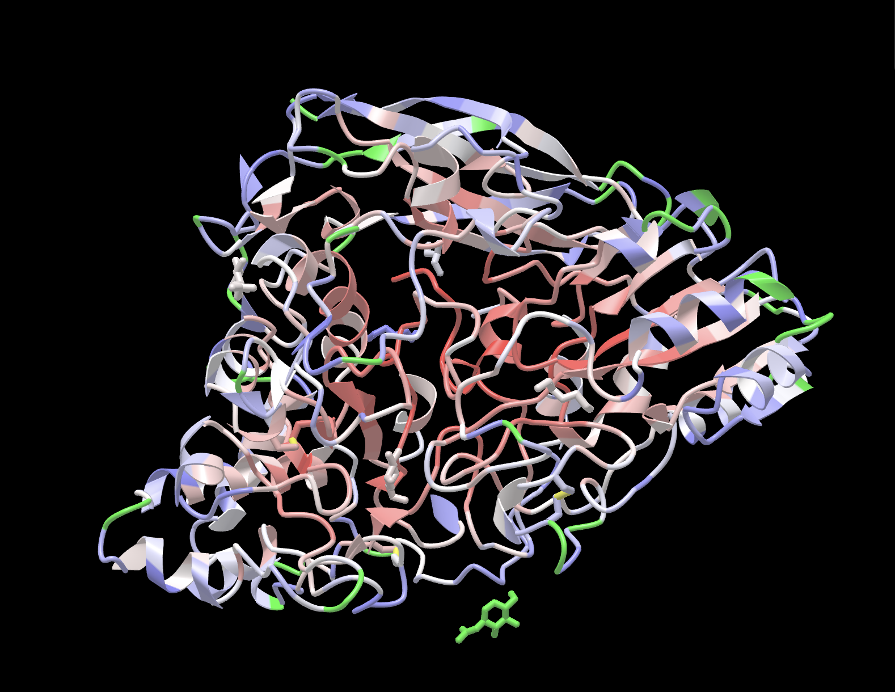

# DPXRust


*Image of 3ZYZ after being run through DPXRust colorized by DPX value*

This is a rewrite of the DPX algorithm in Rust. DPX is an algorithm for computing how buried atoms in a protein structure by finding the distance between the current atom and the nearest atom with an ASA/SASA above a threshold (Defaults to 10.0 Angstroms squared) [1].

## Usage

Make sure that the SASA/ASA value for each atom is in the B-factor field before running DPXRust.

Example:
```shell
./DPXRust --input-path my_protein.pdb --output-path output.csv
```

Note: DPXRust also supports mmCIF files

## Citations:

[1]: Pintar A., Carugo O., Pongor S. DPX: for the analysis of the protein core. Bioinformatics. 2003;19:313–314